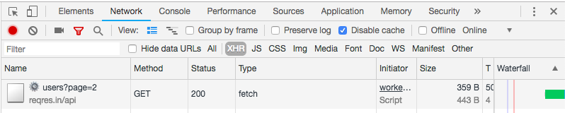

# Basic web worker example
this repo is a basic example of a web-worker handling an async call to a remote web-service.

## Purpose 
It aims at demonstrating basic communication between a main script `index.js` and a worker script `src/js/worker1.js`

## Installation
This gist requires parcel: https://github.com/parcel-bundler/parcel

## Run
```bash 
parcel index.html
```
to run the gist and open a browser tab at `localhost:1234`

## Implementation
`index.js` file declares the worker and post a message to it when user clicks the button.
`onmessage` `worker1.js` sends the call to the API (https://reqres.in/) retrieves the data and sends them back to `index.js`

### Results


## Update
Please feel free to update this example by adding features or more complexity to it